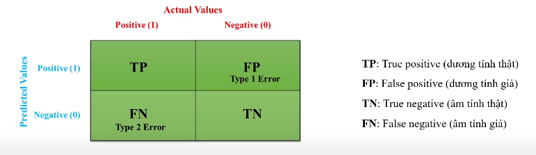
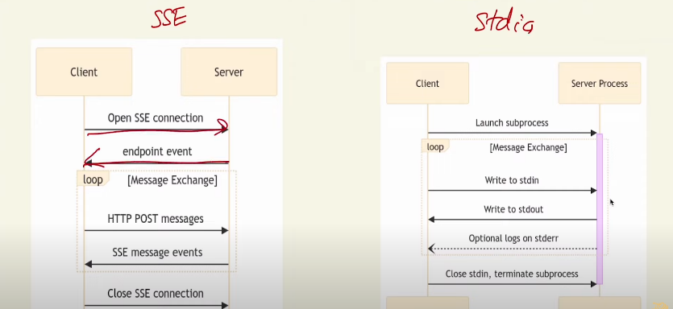

#  Tổng quan về Machine Learning
## I.Định nghĩa
- Machine learning (ML) hay máy học là một nhánh của trí tuệ nhân tạo (AI), nó là một lĩnh vực nghiên cứu cho phép máy tính có khả năng cải thiện chính bản thân chúng dựa trên dữ liệu mẫu (training data) hoặc dựa vào kinh nghiệm (những gì đã được học). 
- Machine learning có thể tự dự đoán hoặc đưa ra quyết định mà không cần được lập trình cụ thể.
## II.Tổng quan về Data Variable
- Trong Machine Learning, dữ liệu được phân loại dựa trên đặc tính để phù hợp với các thuật toán. Các loại chính bao gồm Numerical (biến số), Categorical (biến phân loại), Ordinal (biến thứ tự), và Binary (biến nhị phân). Mỗi loại có đặc điểm riêng và cách xử lý khác nhau, đặc biệt khi chuẩn bị dữ liệu cho mô hình.
### 1. Numerical Variables (Biến số)
    - Là các biến có giá trị là số, dùng để biểu thị các lượng có thể đo lường hoặc tính toán. Chúng được chia thành:
        - Discrete (Rời rạc): Các giá trị là số nguyên, có thể đếm được, ví dụ: số lượng con cái trong một gia đình (0, 1, 2, ...).
        - Continuous (Liên tục): Các giá trị là số thực, có thể nhận bất kỳ giá trị nào trong một khoảng, ví dụ: chiều cao (1.65m, 1.75m), cân nặng (50kg, 60kg), hoặc nhiệt độ.
    - Ứng dụng trong Machine Learning: Numerical variables có thể được sử dụng trực tiếp trong hầu hết các thuật toán như hồi quy tuyến tính, cây quyết định, hoặc mạng nơron, vì chúng đã ở dạng số. Tuy nhiên, để đảm bảo các biến có cùng tỷ lệ và tránh ảnh hưởng đến hiệu suất mô hình, thường cần chuẩn hóa (scaling)
### 2. Categorical Variables (Biến phân loại)
    - Định nghĩa: Categorical variables là các biến dữ liệu biểu thị các danh mục hoặc nhóm, không có giá trị số trực tiếp. Chúng được chia thành hai loại:
        - Nominal (Danh nghĩa): Các danh mục không có thứ tự, ví dụ: màu sắc (đỏ, xanh, vàng), giới tính (nam, nữ), hoặc loại xe (sedan, SUV, truck). Không có mối quan hệ toán học giữa các danh mục.
        - Ordinal (Thứ tự): Các danh mục có thứ tự ý nghĩa, ví dụ: trình độ học vấn (cấp 3, cử nhân, thạc sĩ), mức độ hài lòng (rất hài lòng, hài lòng, không hài lòng). Khoảng cách giữa các danh mục không nhất thiết phải đều.
    - Ứng dụng trong Machine Learning: Hầu hết các thuật toán Machine Learning, như hồi quy tuyến tính hoặc mạng nơron, không thể xử lý trực tiếp categorical variables (trừ một số như Decision Tree). Do đó, cần mã hóa chúng thành dạng số.
### 3. Ordinal Variables (Biến thứ tự)
    - Định nghĩa: Ordinal variables là một loại của categorical variables, nhưng có thứ tự ý nghĩa giữa các danh mục. Tuy nhiên, khoảng cách giữa các danh mục không nhất thiết phải đều nhau. Ví dụ:
        - Trình độ học vấn: cấp 3 < cử nhân < thạc sĩ < tiến sĩ.
        - Xếp hạng: hạng nhất > hạng nhì > hạng ba.
        - Mức độ hài lòng: rất hài lòng > hài lòng > không hài lòng.
    - Ứng dụng trong Machine Learning: Khi mã hóa ordinal variables, cần đảm bảo giữ nguyên thứ tự để mô hình hiểu đúng mối quan hệ. Phương pháp phổ biến là Ordinal Encoding, gán các giá trị số tự nhiên theo thứ tự (ví dụ: hạng nhất = 0, hạng nhì = 1, hạng ba = 2). Tuy nhiên, cần cẩn thận vì một số thuật toán, như hồi quy tuyến tính, có thể hiểu sai khoảng cách giữa các giá trị, coi chúng là đều (interval scale). Trong trường hợp này, có thể cần sử dụng các mô hình không nhạy cảm với khoảng cách, như Decision Tree.
### 4. Binary Variables (Biến nhị phân)
    - Định nghĩa: Binary variables là một loại đặc biệt của categorical variables, chỉ có hai giá trị. Chúng thường được biểu thị bằng 0 và 1, hoặc các giá trị tương đương như có/không, đúng/sai, nam/nữ. Ví dụ:
        - Giới tính: nam (0), nữ (1).
        - Có/không: có (1), không (0).
        - Đúng/sai: đúng (1), sai (0).
    - Ứng dụng trong Machine Learning: Binary variables có thể được sử dụng trực tiếp trong hầu hết các thuật toán Machine Learning vì chúng đã ở dạng số (0 hoặc 1). Không cần mã hóa thêm, trừ khi cần áp dụng các kỹ thuật khác như one-hot encoding (mặc dù không cần thiết, vì đã có hai giá trị). Binary variables thường xuất hiện sau khi mã hóa categorical variables, ví dụ: One-Hot Encoding tạo ra các biến binary cho mỗi danh mục.
## III.Tổng quan về Data Processing
- Là quá trình biến đổi dữ liệu thô (raw data) thành một định dạng sạch và cấu trúc phù hợp để sử dụng trong các thuật toán Machine Learning. Đây là bước cần thiết vì dữ liệu thô thường chứa nhiễu (noise), giá trị thiếu (missing values), và các bất thường (outliers), có thể làm giảm hiệu suất của mô hình.
1.  Data Acquisition (Thu thập dữ liệu)
    - Mô tả: Đây là bước đầu tiên, nơi dữ liệu được thu thập từ các nguồn khác nhau như cơ sở dữ liệu, API, hoặc tệp tin.
    - Tầm quan trọng: Đảm bảo dữ liệu được thu thập đầy đủ và phù hợp với bài toán Machine Learning.
    - Ví dụ: Thu thập dữ liệu từ các hệ thống CRM, công cụ phân tích web, hoặc các kho dữ liệu (data lakes) chứa dữ liệu cấu trúc và không cấu trúc như hình ảnh, video.
2. Data Cleaning (Làm sạch dữ liệu)
    - Mô tả: Xử lý các vấn đề trong dữ liệu thô như giá trị thiếu, dữ liệu nhiễu, và outliers.
    - Các kỹ thuật chính:
        - Xử lý giá trị thiếu (Missing Values):
            - Loại bỏ các hàng hoặc cột chứa giá trị thiếu (phù hợp với tập dữ liệu lớn).
            Điền giá trị thiếu bằng mean, median, mode, hoặc các phương pháp tiên tiến như k-nearest neighbors imputation.
            - Các phương pháp bao gồm bỏ qua các tuple (nếu tập dữ liệu lớn và nhiều giá trị thiếu) hoặc điền giá trị thủ công, sử dụng regression, hoặc mean của thuộc tính.
        - Xử lý dữ liệu nhiễu (Noisy Data):
            - Sử dụng kỹ thuật binning để nhóm dữ liệu và giảm nhiễu.
            - Áp dụng regression hoặc clustering để ước lượng giá trị.
        - Xử lý outliers:
            - Sử dụng clustering để phát hiện và loại bỏ outliers.
            - Hoặc sử dụng các phương pháp robust như robust scaling.
    - Tầm quan trọng: Đảm bảo dữ liệu sạch và chính xác, tránh ảnh hưởng đến hiệu suất mô hình.
3. Data Integration (Tích hợp dữ liệu)
- Mô tả: Kết hợp dữ liệu từ nhiều nguồn khác nhau vào một tập dữ liệu thống nhất.
- Thách thức:
    - Tích hợp schema: Đảm bảo các cấu trúc dữ liệu khác nhau có thể kết hợp được.
    - Xử lý thuộc tính thừa: Loại bỏ các thuộc tính trùng lặp.
    - Giải quyết xung đột giá trị: Xử lý các giá trị không nhất quán từ các nguồn khác nhau.
- Ví dụ: Tích hợp dữ liệu từ các nguồn y tế khác nhau để tạo một tập dữ liệu thống nhất cho phân tích
4. Data Transformation (Chuyển đổi dữ liệu)
- Mô tả: Biến đổi dữ liệu thành định dạng phù hợp cho các thuật toán Machine Learning.
- Các kỹ thuật chính:
    - Mã hóa biến phân loại (Encoding Categorical Variables):
        - One-Hot Encoding: Chuyển đổi các biến nominal thành các cột nhị phân.
        - Label Encoding: Gán số nguyên cho các biến ordinal.
    - Chuẩn hóa dữ liệu (Feature Scaling):
        - Min-Max Scaling: Chuẩn hóa dữ liệu vào khoảng [0, 1].
        - Standardization (Z-Score): Chuẩn hóa dữ liệu với mean = 0 và standard deviation = 1.
    - Robust Scaling: Chuẩn hóa dữ liệu không bị ảnh hưởng bởi outliers.
    - Kỹ thuật khác:
        - Generalization: Tổng quát hóa dữ liệu (ví dụ: chuyển "New York" thành "Hoa Kỳ").
        - Aggregation: Tổng hợp dữ liệu (ví dụ: tính tổng hoặc trung bình).
- Tầm quan trọng: Đảm bảo tất cả các đặc trưng có cùng tỷ lệ, tránh ảnh hưởng của đơn vị đo lường hoặc phạm vi giá trị.
5. Data Reduction (Giảm chiều dữ liệu)
- Mô tả: Giảm kích thước dữ liệu mà không làm mất đi thông tin quan trọng.
- Các kỹ thuật chính:
    - Feature Selection: Chọn các đặc trưng quan trọng nhất.
    - Dimensionality Reduction:
        - Principal Component Analysis (PCA): Giảm số lượng đặc trưng bằng cách tạo ra các thành phần chính.
    - Data Compression: Nén dữ liệu (lossless hoặc lossy).
    - Discretization: Chuyển đổi dữ liệu liên tục thành dạng rời rạc.
- Tầm quan trọng: Giảm chi phí tính toán và tránh overfitting.
6. Data Splitting (Phân chia dữ liệu)
- Mô tả: Chia dữ liệu thành các tập con: training set, validation set, và test set.
- Tỷ lệ phân chia:
    - Training set: 70-80% dữ liệu.
    - Validation set: 10-15% dữ liệu.
    - Test set: 10-15% dữ liệu.
- Tầm quan trọng: Đảm bảo mô hình được đánh giá khách quan và không bị overfitting.
7. Data Validation (Đánh giá chất lượng dữ liệu)
- Mô tả: Kiểm tra chất lượng dữ liệu sau khi tiền xử lý.
- Các hoạt động:
    - Data profiling: Phân tích cấu trúc và nội dung dữ liệu.
    - Data monitoring: Theo dõi chất lượng dữ liệu trong quá trình huấn luyện mô hình.
- Tầm quan trọng: Đảm bảo dữ liệu đáp ứng các tiêu chuẩn về độ chính xác, nhất quán, và hoàn chỉnh.
## IV.Tổng quan về Feature Enginering
- là quá trình chọn, thao tác, và biến đổi dữ liệu thô thành các đặc trưng (features) có thể sử dụng trong học có giám sát. Đây là bước quan trọng để tạo ra các biến mới từ tập huấn luyện, nhằm đơn giản hóa và tăng tốc quá trình biến đổi dữ liệu, đồng thời nâng cao độ chính xác của mô hình. Một "đặc trưng" là bất kỳ đầu vào đo lường nào có thể sử dụng trong mô hình dự đoán, như màu sắc của một vật thể hoặc âm thanh của giọng nói.
1. Filter Methods (Phương pháp lọc)
- Chọn đặc trưng dựa trên các biện pháp thống kê, độc lập với thuật toán học máy. Chúng nhanh và ít tốn tài nguyên, nhưng có thể bỏ sót các tương tác phức tạp giữa các đặc trưng.
    - Information Gain: Đo lường giảm entropy khi bao gồm một đặc trưng. Đặc trưng có Information Gain cao được chọn. Ví dụ, trong phân loại email, Information Gain có thể chọn từ khóa "spam" làm đặc trưng quan trọng.
    - Chi-square Test: Dùng cho đặc trưng phân loại, kiểm tra tính độc lập với biến mục tiêu. Đặc trưng có điểm Chi-square cao được chọn
    - Fisher’s Score: Xếp hạng đặc trưng dựa trên khả năng phân biệt giữa các lớp, thường dùng trong bài toán phân loại.
    - Correlation Coefficient: Chọn đặc trưng có mối quan hệ tuyến tính mạnh với biến mục tiêu, sử dụng hệ số tương quan Pearson, với ngưỡng như 0.5. Có thể trực quan hóa bằng heatmap seaborn
    - Variance Threshold: Loại bỏ đặc trưng có phương sai thấp, giả định chúng ít thông tin. Ví dụ, nếu một đặc trưng luôn có giá trị 0, nó sẽ bị loại bỏ.
2. Wrapper Methods (Phương pháp bao bọc)
- Sử dụng mô hình để đánh giá tập con đặc trưng, dựa trên hiệu suất của mô hình. Chúng chính xác hơn nhưng tốn nhiều tài nguyên tính toán.
    - Forward Selection: Bắt đầu với tập rỗng, thêm từng đặc trưng làm tăng hiệu suất mô hình nhất. Ví dụ, dùng SequentialFeatureSelector từ mlxtend với forward=True.
    - Backward Elimination: Bắt đầu với tất cả đặc trưng, loại bỏ từng đặc trưng làm giảm hiệu suất ít nhất
    - Recursive Feature Elimination (RFE): Loại bỏ đệ quy đặc trưng ít quan trọng nhất dựa trên trọng số mô hình, dùng RFE từ sklearn, ví dụ chọn 7 đặc trưng.
    - Exhaustive Feature Selection: Đánh giá tất cả tổ hợp đặc trưng, chọn tập con tốt nhất dựa trên chỉ số hiệu suất
3. Embedded Methods (Phương pháp nhúng)
- Embedded Methods tích hợp chọn đặc trưng vào quá trình huấn luyện mô hình, hiệu quả và tiết kiệm thời gian.
    - LASSO Regularization (L1): Thêm hình phạt L1 vào hàm mất mát, làm một số hệ số đặc trưng bằng 0, hiệu quả loại bỏ đặc trưng không quan trọng. Dùng LogisticRegression với penalty='l1' và SelectFromModel từ sklearn
    - Random Forest Importance: Xếp hạng đặc trưng dựa trên mức độ giảm impurity (như Gini) qua các cây trong rừng ngẫu nhiên. Dùng RandomForestClassifier với n_estimators=340, trực quan hóa độ quan trọng
## V.Tổng quan về Model Training
- Là một chuỗi các bước nhằm xây dựng một mô hình có thể học từ dữ liệu và đưa ra dự đoán chính xác.
1. Thu thập dữ liệu
    - Mô tả: Thu thập dữ liệu từ các nguồn như cơ sở dữ liệu, API, web scraping, hoặc nhập liệu thủ công,  dữ liệu cần đủ lượng và đại diện cho bài toán.
    - Chi tiết: Ví dụ, cho bài toán dự đoán giá nhà, cần thu thập dữ liệu về diện tích, vị trí, số phòng, và giá nhà từ các nguồn như trang web bất động sản hoặc cơ sở dữ liệu công cộng. Đảm bảo dữ liệu không bị thiên vị (bias) và đủ lớn để huấn luyện.
    - Tầm quan trọng: Chất lượng dữ liệu ảnh hưởng trực tiếp đến hiệu suất mô hình.
2. Chuẩn bị và tiền xử lý dữ liệu
    - Mô tả: Làm sạch và biến đổi dữ liệu để phù hợp với mô hình. Bao gồm xử lý giá trị thiếu, loại bỏ dữ liệu trùng lặp, và chuẩn hóa.
    - Chi tiết:
        - Xử lý giá trị thiếu: Điền bằng mean, median, hoặc loại bỏ hàng/cột nếu cần.
        - Mã hóa biến phân loại: Sử dụng One-Hot Encoding cho biến nominal, Ordinal Encoding cho biến ordinal.
        - Chuẩn hóa: Áp dụng Min-Max Scaling hoặc Standardization để đưa dữ liệu về cùng tỷ lệ.
        - Phân chia dữ liệu: Chia thành tập huấn luyện (70-80%), xác thực (10-15%), và kiểm tra (10-15%).
        - Ví dụ: Trong bài toán giá nhà, chuẩn hóa diện tích (0-1) và mã hóa loại nhà (biệt thự, chung cư) thành số.
    - Tầm quan trọng: Đảm bảo dữ liệu sạch, không nhiễu, và phù hợp với thuật toán.
3. Chọn mô hình phù hợp
    - Mô tả: Lựa chọn thuật toán Machine Learning dựa trên loại bài toán và đặc điểm dữ liệu. Cần xem xét độ phức tạp, tính diễn giải, và nguồn lực tính toán.
    - Chi tiết:
        - Đối với hồi quy: Hồi quy tuyến tính, Random Forest, Gradient Boosting.
        - Đối với phân loại: Logistic Regression, Decision Tree, SVM, Neural Networks.
        - Ví dụ: Cho bài toán giá nhà, có thể chọn Linear Regression vì tính đơn giản, hoặc Random Forest để tăng độ chính xác.
    - Tầm quan trọng: Thuật toán phù hợp giúp mô hình học hiệu quả hơn.
4. Huấn luyện mô hình
    - Mô tả: Sử dụng tập dữ liệu huấn luyện để dạy mô hình học các mẫu và mối quan hệ. Bao gồm điều chỉnh tham số để giảm lỗi.
    - Chi tiết:
        - Khởi tạo mô hình, sau đó sử dụng thuật toán như gradient descent để tối ưu hóa.
        - Theo dõi để tránh overfitting (học quá mức) hoặc underfitting (học quá ít).
        - Ví dụ: Trong hồi quy tuyến tính, mô hình học các hệ số (coefficients) để dự đoán giá nhà dựa trên diện tích và vị trí.
    - Tầm quan trọng: Đảm bảo mô hình học được các mẫu quan trọng từ dữ liệu.
5. Đánh giá hiệu suất mô hình
    - Mô tả: Kiểm tra hiệu suất trên tập dữ liệu kiểm tra để đảm bảo tổng quát hóa. Sử dụng các chỉ số đánh giá.
    - Chi tiết:
        - Đối với hồi quy: MAE, MSE, RMSE, R².
        - Đối với phân loại: Accuracy, Precision, Recall, F1-score, AUC-ROC, ma trận nhầm lẫn.
        - Ví dụ: Đối với bài toán giá nhà, sử dụng MSE để đo sai số trung bình bình phương.
        - Sử dụng K-fold cross-validation để đánh giá ổn định.
    - Tầm quan trọng: Đảm bảo mô hình hoạt động tốt trên dữ liệu mới.
6. Tinh chỉnh và tối ưu hóa mô hình
    - Mô tả: Điều chỉnh siêu tham số để cải thiện hiệu suất. Sử dụng các kỹ thuật như grid search hoặc random search.
    - Chi tiết:
        - Siêu tham số bao gồm tỷ lệ học (learning rate), độ sâu cây (max depth), hoặc số cây trong Random Forest.
        - Ví dụ: Tinh chỉnh độ sâu cây quyết định để tránh overfitting.
        - Sử dụng cross-validation để đánh giá hiệu quả sau khi tinh chỉnh.
    - Tầm quan trọng: Tối ưu hóa giúp mô hình đạt hiệu suất cao nhất.
## VI. Tổng quan về Model Evaluation
* Confusion Martric(Ma trận nhầm lẫn):  

1. Accuracy
    - Là độ đo của bài toán phân loại mà đơn giản nhất, tính toán bằng cách lấy số dự đoán đúng chia cho toàn bộ các dự đoán.
    $\text{Accurary} = \frac{\text{TP}+\text{TN}}{\text{TP} + \text{TN} + \text{FP} +\text{TN}}$
    - Phép đo độ chính xác đơn giản dễ hiểu nhưng không phù hợp với dữ liệu không cân bằng
2. Precision
    - Là độ đo của bài toán phân loại mà đơn giản nhất, tính toán bằng cách lấy số dương tính thật chia cho tổng dương tính dự đoán .  
    $\text{Precision} = \frac{\text{TP}}{\text{TP}+\text{FP}}$
    - Sử dụng khi dương tính giả quan trọng hơn âm tính giả
3. Recall
    - Là một metric quan trọng, tính toán bằng cách lấy số dương tính thật chia cho tổng các dương tính thực tế  
    $\text{Recall} = \frac{\text{TP}}{\text{TP}+\text{FN}}$
    - Sử dụng khi giá trị âm tính giả quan trọng hơn dương tính giả
4. F1-score
   - Là một metric phổ biến đã kết hợp cả Recall và Precision  
    $\text{F1-score} = \frac{2 * \text{Recall} * \text{Precision}}{\text{Recall} + \text{Precision}}$
    - Phụ thuộc vào data và vấn đề để dự đoán
# Tổng quan về Model Context Protocol
## I.Định nghĩa
- Là một tiêu chuẩn mã nguồn mở giúp AI kết nối và tương tác với các nguồn dữ liệu, công cụ và APi bên ngoài. Nó hoạt động như một "cổng USB" cho AI, giúp đơn giản hóa việc truy cập dữ liệu theo thời gian thực
- Mục đích chính của MCP là:
    - Hỗ trợ xây dựng các agent AI và quy trình làm việc phức tạp trên LLM.
    - Cung cấp danh sách tích hợp sẵn có, cho phép LLM dễ dàng kết nối với các công cụ và dữ liệu.
    - Đảm bảo khả năng chuyển đổi giữa các nhà cung cấp LLM và công cụ, đồng thời áp dụng các thực hành tốt nhất để bảo mật dữ liệu trong hạ tầng.
- MCP hoạt động dựa trên kiến trúc Client-Server(máy chủ-máy khách) :
    - MCP Hosts : Các ứng dụng AI (như Claude Desktop hoặc IDEs) muốn truy cập dữ liệu thông qua MCP. Chúng khởi tạo yêu cầu để lấy dữ liệu hoặc thực hiện hành động.
    - MCP Clients : Các ứng dụng khách duy trì kết nối 1:1 với MCP Servers, đảm bảo giao tiếp ổn định và an toàn.
    - MCP Servers : Các chương trình nhẹ cung cấp khả năng cụ thể (ví dụ: truy cập Google Drive, GitHub, hoặc cơ sở dữ liệu cục bộ) thông qua giao thức chuẩn hóa
    - Hoạt động: MCP sử dụng mô hình client-server để truyền tải ngữ cảnh (dữ liệu, công cụ) từ server đến client, giúp AI thực hiện các tác vụ như tìm kiếm, truy xuất tệp, hoặc thực thi lệnh.
- MCP bao gồm ba loại thành phần chính:
    - Tools: Các hàm hoặc chức năng mà LLM có thể gọi để thực hiện hành động, được điều khiển bởi mô hình AI. Ví dụ: Gọi API thời tiết, tạo kho GitHub.
    - Resources: Các nguồn dữ liệu mà LLM có thể truy cập, giống như endpoint GET trong REST API, không có tác dụng phụ. Ví dụ: Truy cập tệp tin, cơ sở dữ liệu.
    - Prompts: Các mẫu tương tác được tối ưu hóa, giúp LLM hiểu rõ yêu cầu của người dùng, được điều khiển bởi người dùng. Ví dụ: Mẫu gợi ý cho code review.
- MCP có 2 giao thức
  - Stdio(Standard IO): Dùng cho các tác vụ cục bộ trên cùng một máy tính, như truy cập tệp tin hoặc chạy script. Phương thức này phù hợp cho các server chạy trên cùng máy với ứng dụng AI.
  - SSE(Sever send event): Dùng cho kết nối từ xa, cho phép giao tiếp thời gian thực từ server đến client, chẳng hạn khi theo dõi thay đổi tệp tin trên Google Drive.
  
## II. Hoạt động
1. Khởi tạo:
   - MCP Host (ứng dụng AI) tạo ra các MCP Clients.
    - MCP Clients thực hiện handshake với MCP Servers để trao đổi thông tin về khả năng và phiên bản giao thức, đảm bảo cả hai bên tương thích.
2. Khám phá:
    - MCP Clients yêu cầu MCP Servers cung cấp danh sách các công cụ (Tools), tài nguyên (Resources), và gợi ý (Prompts) mà chúng hỗ trợ.
    - Ví dụ, một server có thể trả về danh sách các công cụ như "tạo kho GitHub" hoặc "truy cập tệp tin".
3. Cung cấp ngữ cảnh:
    - MCP Host làm cho các tài nguyên và gợi ý có sẵn cho LLM hoặc định dạng các công cụ (ví dụ: chuyển đổi thành JSON để LLM có thể hiểu).
    - Điều này giúp LLM có ngữ cảnh đầy đủ để xử lý yêu cầu.
4. Gọi công cụ:
    - LLM gọi một công cụ thông qua MCP Client, ví dụ yêu cầu kiểm tra thời tiết.
    - MCP Client chuyển yêu cầu này đến MCP Server phù hợp.
5. Thực thi:
    - MCP Server thực hiện logic yêu cầu, chẳng hạn gọi API thời tiết hoặc truy cập tệp tin.
    - Server có thể sử dụng các phương thức truyền tải như stdio (cho tác vụ cục bộ) hoặc HTTP qua SSE (cho kết nối từ xa).
6. Trả về kết quả:
    - MCP Server trả về kết quả cho MCP Client, ví dụ dữ liệu thời tiết hoặc nội dung tệp tin.
7. Hoàn tất:
    - MCP Client chuyển kết quả về MCP Host, và LLM sử dụng kết quả này để tạo phản hồi cuối cùng cho người dùng.